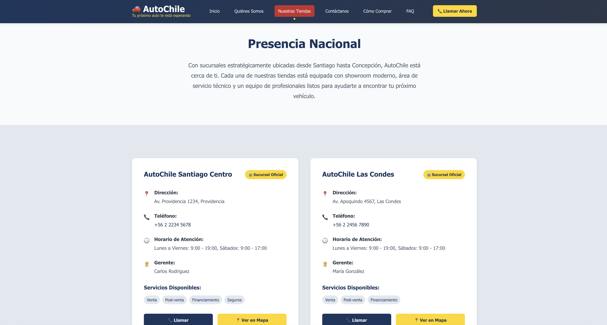
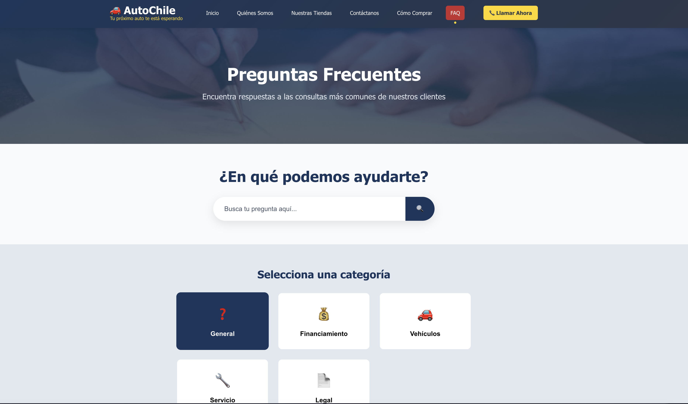
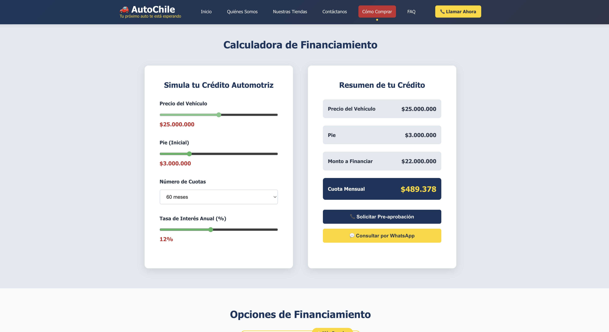
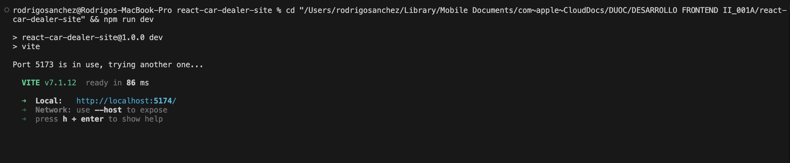
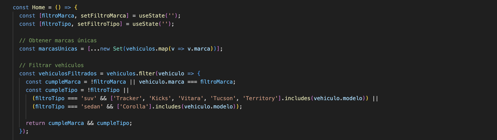

<div align="center">

# 🚗 AutoChile - Sitio Web de Concesionario

[](https://reactjs.org/)
[](https://vitejs.dev/)
[](https://reactrouter.com/)
[](./LICENSE)

**Plataforma web moderna y completamente funcional para la gestión y visualización de inventario de vehículos en un concesionario automotriz chileno.**

[Demo en Vivo](https://rodrigosanchezdev.github.io/react-car-dealer-site/) • [Reportar Bug](https://github.com/RodrigoSanchezDev/react-car-dealer-site/issues) • [Solicitar Funcionalidad](https://github.com/RodrigoSanchezDev/react-car-dealer-site/issues)

</div>

---

## 📋 Tabla de Contenidos

- [Descripción General](#-descripción-general)
- [Características Principales](#-características-principales)
- [Tecnologías Utilizadas](#️-tecnologías-utilizadas)
- [Estructura del Proyecto](#-estructura-del-proyecto)
- [Instalación y Configuración](#-instalación-y-configuración)
- [Scripts Disponibles](#-scripts-disponibles)
- [Funcionalidades Detalladas](#-funcionalidades-detalladas)
- [Arquitectura de Componentes](#️-arquitectura-de-componentes)
- [Capturas de Pantalla](#-capturas-de-pantalla)
- [Roadmap](#-roadmap)
- [Contribuciones](#-contribuciones)
- [Licencia](#-licencia)
- [Autor](#-autor)
- [Agradecimientos](#-agradecimientos)

---

## 🌟 Descripción General

**AutoChile** es una aplicación web moderna y responsiva desarrollada con **React** y **Vite** que simula el sitio web de un concesionario de vehículos en Chile. El proyecto implementa las mejores prácticas de desarrollo frontend, incluyendo:

- ✅ Arquitectura de componentes reutilizables
- ✅ Navegación con React Router
- ✅ Diseño responsivo y mobile-first
- ✅ Código limpio y bien documentado
- ✅ Optimización de rendimiento
- ✅ Experiencia de usuario fluida

El sitio permite a los usuarios explorar un catálogo de vehículos, filtrar por características, conocer información institucional, ubicar sucursales y contactar al concesionario.

---

## ✨ Características Principales

### 🚘 Catálogo de Vehículos
- **Visualización de Inventario**: Cards interactivas con información detallada de cada vehículo
- **Filtros Inteligentes**: Filtrado dinámico por marca y tipo de vehículo
- **Información Completa**: Precio, especificaciones técnicas, características y ubicación
- **Formato Chileno**: Precios en CLP y kilometraje adaptado a la región

### 🏢 Información Institucional
- **Quiénes Somos**: Historia, misión, visión y valores del concesionario
- **Equipo Directivo**: Presentación del equipo con fotos y roles
- **Logros y Reconocimientos**: Destacados del concesionario
- **Compromiso Social**: Iniciativas de responsabilidad social

### 📍 Gestión de Sucursales
- **4 Sucursales**: Cobertura en Santiago, Valparaíso y Concepción
- **Información Detallada**: Dirección, horarios, teléfonos y servicios disponibles
- **Integración con Mapas**: Enlaces directos a Google Maps
- **Servicios Diferenciados**: Venta, post-venta, financiamiento y seguros

### 📞 Contacto y Servicio al Cliente
- **Formulario de Contacto**: Envío de consultas con validación
- **Múltiples Canales**: Teléfono, email, WhatsApp y visitas presenciales
- **Horarios de Atención**: Información detallada por tipo de servicio
- **FAQ Rápido**: Respuestas a preguntas frecuentes

### 🛒 Proceso de Compra
- **Guía Paso a Paso**: Desde la selección hasta la entrega
- **Información de Financiamiento**: Opciones y requisitos
- **Métodos de Pago**: Transferencia, efectivo y financiamiento
- **Garantía y Post-venta**: Detalles del servicio

### 💡 Funcionalidades Técnicas
- **Navegación SPA**: Single Page Application con React Router
- **Componentes Reutilizables**: Header, Footer, VehiculoCard
- **Estado Local**: Gestión de filtros con React Hooks
- **Utilidades**: Funciones helper para formato de precios y datos
- **Diseño Responsivo**: Adaptable a móviles, tablets y desktop

---

## 🛠️ Tecnologías Utilizadas

### Core
| Tecnología | Versión | Propósito |
|-----------|---------|-----------|
| **React** | 19.1.1 | Librería de interfaces de usuario |
| **Vite** | 7.1.7 | Build tool y dev server ultra-rápido |
| **React Router DOM** | 7.9.4 | Enrutamiento y navegación |

### Desarrollo y Calidad
| Herramienta | Versión | Propósito |
|------------|---------|-----------|
| **ESLint** | 9.36.0 | Linting y calidad de código |
| **@vitejs/plugin-react** | 5.0.4 | Plugin de Vite para React |
| **eslint-plugin-react-hooks** | 5.2.0 | Reglas para React Hooks |
| **eslint-plugin-react-refresh** | 0.4.22 | Fast Refresh en desarrollo |

### Lenguajes
- **JavaScript (ES6+)**: Lógica de la aplicación
- **JSX**: Sintaxis de componentes React
- **CSS3**: Estilos y diseño responsivo
- **HTML5**: Estructura base

---

## 📁 Estructura del Proyecto

```
react-car-dealer-site/
│
├── public/                          # Archivos estáticos públicos
│
├── src/                             # Código fuente principal
│   ├── assets/                      # Recursos (imágenes, iconos, etc.)
│   │
│   ├── components/                  # Componentes reutilizables
│   │   ├── Header.jsx               # Navegación principal
│   │   ├── Header.css
│   │   ├── Footer.jsx               # Pie de página
│   │   ├── Footer.css
│   │   ├── VehiculoCard.jsx         # Card de vehículo
│   │   └── VehiculoCard.css
│   │
│   ├── pages/                       # Páginas/Vistas
│   │   ├── Home.jsx                 # Página principal con catálogo
│   │   ├── Home.css
│   │   ├── QuienesSomos.jsx         # Información institucional
│   │   ├── QuienesSomos.css
│   │   ├── NuestrasTiendas.jsx      # Ubicación de sucursales
│   │   ├── NuestrasTiendas.css
│   │   ├── Contactanos.jsx          # Formulario de contacto
│   │   ├── Contactanos.css
│   │   ├── ComoComprar.jsx          # Proceso de compra
│   │   ├── ComoComprar.css
│   │   ├── PreguntasFrecuentes.jsx  # FAQ
│   │   └── PreguntasFrecuentes.css
│   │
│   ├── data/                        # Datos de la aplicación
│   │   └── vehiculos.js             # Inventario y sucursales
│   │
│   ├── utils/                       # Funciones de utilidad
│   │   └── helpers.js               # Helpers generales
│   │
│   ├── App.jsx                      # Componente principal
│   ├── App.css                      # Estilos globales de App
│   ├── main.jsx                     # Punto de entrada
│   └── index.css                    # Estilos globales base
│
├── eslint.config.js                 # Configuración ESLint
├── vite.config.js                   # Configuración Vite
├── package.json                     # Dependencias y scripts
├── index.html                       # HTML base
├── LICENSE                          # Licencia MIT
└── README.md                        # Este archivo
```

### 📂 Descripción de Directorios Clave

#### `/src/components`
Componentes reutilizables que se utilizan en múltiples páginas:
- **Header**: Barra de navegación con enlaces activos
- **Footer**: Información de contacto y enlaces
- **VehiculoCard**: Tarjeta de presentación de vehículos

#### `/src/pages`
Vistas completas correspondientes a cada ruta:
- **Home**: Catálogo principal con filtros
- **QuienesSomos**: Historia y valores
- **NuestrasTiendas**: Sucursales y servicios
- **Contactanos**: Formulario y canales de contacto
- **ComoComprar**: Guía de compra
- **PreguntasFrecuentes**: FAQ

#### `/src/data`
Datos estructurados de la aplicación:
- **vehiculos**: Inventario de vehículos y sucursales
- Funciones de formato (precios, kilometraje)

#### `/src/utils`
Utilidades y funciones helper:
- Validación de RUT
- Cálculo de cuotas
- Generación de links WhatsApp
- Constantes (regiones, marcas)

---

## 🚀 Instalación y Configuración

### Prerrequisitos

Antes de comenzar, asegúrate de tener instalado:

- **Node.js** (versión 18.0 o superior) - [Descargar](https://nodejs.org/)
- **npm** (normalmente viene con Node.js) o **yarn**
- **Git** - [Descargar](https://git-scm.com/)

### Pasos de Instalación

1. **Clonar el repositorio**
   ```bash
   git clone https://github.com/RodrigoSanchezDev/react-car-dealer-site.git
   cd react-car-dealer-site
   ```

2. **Instalar dependencias**
   ```bash
   npm install
   ```
   o si prefieres yarn:
   ```bash
   yarn install
   ```

3. **Iniciar el servidor de desarrollo**
   ```bash
   npm run dev
   ```

4. **Abrir en el navegador**
   
   El proyecto estará disponible en `http://localhost:5173`

### 🌐 Configuración para Producción

Para construir el proyecto para producción:

```bash
npm run build
```

Los archivos optimizados se generarán en la carpeta `dist/`.

Para previsualizar el build de producción localmente:

```bash
npm run preview
```

---

## 📜 Scripts Disponibles

En el directorio del proyecto, puedes ejecutar:

### `npm run dev`
Inicia el servidor de desarrollo con hot-reload.
- URL: `http://localhost:5173`
- Cambios en tiempo real
- Fast Refresh habilitado

### `npm run build`
Construye la aplicación para producción en la carpeta `dist/`.
- Optimización de código
- Minificación de assets
- Tree-shaking de dependencias
- Source maps generados

### `npm run preview`
Previsualiza el build de producción localmente.
- Simula entorno de producción
- Útil para testing pre-deployment

### `npm run lint`
Ejecuta ESLint para analizar el código.
- Detecta errores de sintaxis
- Identifica problemas de estilo
- Verifica reglas de React Hooks

---

## 🎯 Funcionalidades Detalladas

### 🏠 Página Principal (Home)

#### Hero Section
- Banner principal con call-to-action
- Botones de navegación a vehículos y financiamiento
- Diseño atractivo con overlay

#### Estadísticas
- 15+ años de experiencia
- 5,000+ clientes satisfechos
- 10 marcas disponibles
- 4 sucursales en Chile

#### Sistema de Filtros
```javascript
// Filtros disponibles:
- Por Marca: Toyota, Chevrolet, Nissan, Suzuki, Hyundai, Ford
- Por Tipo: Sedán, SUV/Crossover
- Botón de reseteo de filtros
```

#### Catálogo de Vehículos
Cada tarjeta incluye:
- Imagen del vehículo
- Marca y modelo
- Precio en CLP (formato chileno)
- Año de fabricación
- Tipo de combustible
- Transmisión
- Kilometraje
- Color
- Ubicación
- Características destacadas
- Botones de acción (Ver Detalles, Contactar)

#### Sección de Servicios
4 servicios principales:
1. 💰 Financiamiento Flexible
2. 🛡️ Garantía Extendida
3. 🔧 Servicio Técnico
4. 📄 Gestión de Documentación

#### Call to Action Final
- Botón de llamada directa
- Enlace a WhatsApp Business

### 👥 Quiénes Somos

#### Historia del Concesionario
- Fundación en 2009
- Evolución y crecimiento
- Compromiso con los clientes

#### Misión, Visión y Valores
- **Misión**: Facilitar acceso a vehículos de calidad
- **Visión**: Ser líder en Chile
- **Valores**: Transparencia, excelencia, confianza, compromiso

#### Equipo Directivo
- Carlos Rodriguez (CEO & Fundador)
- María González (Directora Comercial)
- Juan Silva (Director de Operaciones)

#### Logros Destacados
- 🏆 Premio Excelencia 2023
- 🌟 5,000+ Clientes Satisfechos
- 🌱 Carbono Neutral 2024
- 📈 15 Años de Crecimiento

#### Compromiso Social
- 🎓 Programa de Becas
- 🌳 Reforestación
- 🚗 Movilidad Social
- ♻️ Reciclaje Vehicular

### 🏪 Nuestras Tiendas

#### Sucursales Disponibles

**Santiago Centro** (Providencia)
- Dirección: Av. Providencia 1234
- Teléfono: +56 2 2234 5678
- Gerente: Carlos Rodriguez
- Servicios: Venta, Post-venta, Financiamiento, Seguros

**Las Condes** (Sector Oriente)
- Dirección: Av. Apoquindo 4567
- Teléfono: +56 2 2456 7890
- Gerente: María González
- Servicios: Venta, Post-venta, Financiamiento

**Valparaíso**
- Dirección: Av. Brasil 890
- Teléfono: +56 32 234 5678
- Gerente: Juan Silva
- Servicios: Venta, Financiamiento, Seguros

**Concepción**
- Dirección: Av. O'Higgins 1567
- Teléfono: +56 41 345 6789
- Gerente: Ana Morales
- Servicios: Venta, Post-venta, Financiamiento

#### Servicios por Sucursal
- 🚗 Showroom con vehículos en exhibición
- 💰 Financiamiento con bancos principales
- 🔧 Servicio técnico certificado
- 🛡️ Seguros vehiculares

### 📞 Contáctanos

#### Canales de Contacto
- 📞 **Teléfono**: +56 2 2234 5678
- 💬 **WhatsApp**: +56 9 2234 5678
- 📧 **Email**: info@autochile.cl
- 📍 **Visitas**: Av. Providencia 1234, Santiago

#### Formulario de Contacto
Campos incluidos:
- Nombre completo
- Email
- Teléfono
- Tipo de consulta (General, Vehículo, Financiamiento, Post-venta, Garantía)
- Vehículo de interés (dropdown)
- Mensaje

#### Horarios de Atención
- 📞 **Telefónico**: Lun-Vie 9:00-19:00, Sáb 9:00-17:00, Dom 10:00-14:00
- 🏪 **Showroom**: Lun-Vie 9:00-19:00, Sáb 9:00-17:00
- 🔧 **Servicio Técnico**: Lun-Vie 8:00-18:00, Sáb 8:00-13:00
- 💬 **WhatsApp**: Lun-Sáb 8:00-20:00, Dom 10:00-18:00

### 🛒 Cómo Comprar

Guía completa del proceso de compra:
1. **Selección del Vehículo**
2. **Evaluación Financiera**
3. **Documentación**
4. **Firma de Contrato**
5. **Entrega del Vehículo**

### ❓ Preguntas Frecuentes

FAQ completo sobre:
- Proceso de compra
- Financiamiento
- Garantías
- Post-venta
- Documentación
- Entregas

---

## 🏗️ Arquitectura de Componentes

### Flujo de Datos

```
App.jsx (Router Principal)
    │
    ├── Header (Navegación)
    │
    ├── Routes
    │   ├── Home
    │   │   └── VehiculoCard (múltiples)
    │   ├── QuienesSomos
    │   ├── NuestrasTiendas
    │   ├── Contactanos
    │   ├── ComoComprar
    │   └── PreguntasFrecuentes
    │
    └── Footer
```

### Componentes Principales

#### `<App />`
Componente raíz que configura el Router y estructura general.

```jsx
function App() {
  return (
    <Router>
      <Header />
      <main>
        <Routes>
          {/* Rutas */}
        </Routes>
      </main>
      <Footer />
    </Router>
  );
}
```

#### `<Header />`
Navegación principal con detección de ruta activa.

**Props**: Ninguna  
**Hooks**: `useLocation()` de React Router

#### `<VehiculoCard />`
Card reutilizable para mostrar información de vehículos.

**Props**:
- `vehiculo` (object): Datos del vehículo

**Estructura**:
```jsx
{
  marca, modelo, año, precio, imagen,
  combustible, transmision, kilometraje,
  color, ubicacion, caracteristicas
}
```

#### `<Footer />`
Pie de página con información de contacto y enlaces.

### Data Layer

#### `vehiculos.js`
Archivo centralizado de datos con:
- Array de vehículos (6 unidades)
- Array de sucursales (4 ubicaciones)
- Funciones de formato (`formatearPrecio`, `formatearKilometraje`)

#### `helpers.js`
Utilidades generales:
- `formatearFecha()`: Formato de fechas en español chileno
- `validarRUT()`: Validación básica de RUT
- `generarLinkWhatsApp()`: Generación de enlaces WhatsApp
- `calcularCuotaAproximada()`: Simulación de financiamiento
- Constantes: `REGIONES_CHILE`, `MARCAS_POPULARES`

---

## 📸 Capturas de Pantalla

<div align="center">

### 🏠 Página Principal (Home)
Catálogo completo con filtros dinámicos, estadísticas y call-to-action


---

### 📍 Nuestras Tiendas
Mapa de sucursales con información detallada de contacto y servicios disponibles



---

### 📞 Contáctanos
Sistema de contacto multi-canal con formulario interactivo y validación


---

### ❓ Preguntas Frecuentes (FAQ)
Centro de ayuda con categorías organizadas y buscador de preguntas



---

### 💰 Calculadora de Financiamiento
Simulador interactivo de crédito automotriz con cálculo en tiempo real



---

### 💻 Servidor de Desarrollo
Aplicación corriendo en localhost con Vite



---

### ⚛️ Implementación de useState
Código del componente Home.jsx mostrando uso del hook useState para filtros dinámicos



</div>

---

## 🗺️ Roadmap

### ✅ Fase 1 - Completado (v1.0.0)
- [x] Estructura base con React + Vite
- [x] Navegación con React Router
- [x] Componentes principales (Header, Footer, VehiculoCard)
- [x] Páginas institucionales
- [x] Sistema de filtros
- [x] Diseño responsivo
- [x] Datos estáticos

### 🚧 Fase 2 - En Planificación (v1.1.0)
- [ ] Integración con backend (API REST)
- [ ] Sistema de autenticación
- [ ] Panel de administración
- [ ] Gestión dinámica de inventario
- [ ] Sistema de favoritos
- [ ] Comparador de vehículos

### 🔮 Fase 3 - Futuro (v2.0.0)
- [ ] Sistema de reservas online
- [ ] Calculadora de financiamiento interactiva
- [ ] Chat en vivo
- [ ] Test drive virtual (360°)
- [ ] Integración con CRM
- [ ] App móvil (React Native)
- [ ] Sistema de notificaciones
- [ ] Historial de mantenimiento

### 💡 Mejoras Técnicas Planificadas
- [ ] Migración a TypeScript
- [ ] Testing (Jest + React Testing Library)
- [ ] CI/CD con GitHub Actions
- [ ] Optimización de imágenes (lazy loading)
- [ ] PWA (Progressive Web App)
- [ ] Accesibilidad (WCAG 2.1)
- [ ] Internacionalización (i18n)
- [ ] Análisis con Google Analytics

---

## 🤝 Contribuciones

¡Las contribuciones son bienvenidas! Este proyecto está abierto a mejoras y nuevas funcionalidades.

### Cómo Contribuir

1. **Fork el proyecto**
   ```bash
   # Haz fork desde GitHub
   ```

2. **Crea una rama para tu feature**
   ```bash
   git checkout -b feature/AmazingFeature
   ```

3. **Commit tus cambios**
   ```bash
   git commit -m 'Add: Amazing new feature'
   ```

4. **Push a la rama**
   ```bash
   git push origin feature/AmazingFeature
   ```

5. **Abre un Pull Request**

### Guía de Estilo

#### Commits
Utilizamos [Conventional Commits](https://www.conventionalcommits.org/):
- `feat:` Nueva funcionalidad
- `fix:` Corrección de bug
- `docs:` Cambios en documentación
- `style:` Formato, puntos y comas, etc.
- `refactor:` Refactorización de código
- `test:` Agregar tests
- `chore:` Mantenimiento

Ejemplo:
```bash
git commit -m "feat: add vehicle comparison feature"
git commit -m "fix: resolve filter reset bug"
git commit -m "docs: update installation instructions"
```

#### Código
- Utiliza ESLint (configuración incluida)
- Componentes funcionales con Hooks
- Nombres descriptivos en español para variables de negocio
- Comentarios en español
- PropTypes o TypeScript (futuro)

### Reportar Bugs

Si encuentras un bug, por favor abre un [issue](https://github.com/RodrigoSanchezDev/react-car-dealer-site/issues) con:
- Descripción del problema
- Pasos para reproducir
- Comportamiento esperado vs actual
- Screenshots (si aplica)
- Información del navegador/sistema

### Solicitar Funcionalidades

Para solicitar nuevas funcionalidades, abre un [issue](https://github.com/RodrigoSanchezDev/react-car-dealer-site/issues) con:
- Descripción clara de la funcionalidad
- Casos de uso
- Mockups o ejemplos (si aplica)

---

## 📄 Licencia

Este proyecto está licenciado bajo la **Licencia MIT**.

Copyright (c) 2025 Rodrigo Sánchez

Consulta el archivo [LICENSE](./LICENSE) para más detalles.

### ¿Qué significa esto?

✅ **Puedes**:
- Usar el código comercialmente
- Modificar el código
- Distribuir el código
- Uso privado

❗ **Debes**:
- Incluir el aviso de copyright
- Incluir la licencia MIT

🚫 **No puedes**:
- Hacer responsable al autor

---

## 👨‍💻 Autor

<div align="center">

### Rodrigo Sánchez

**Desarrollador Full Stack | Especialista en React**

[](mailto:rodrigo@sanchezdev.com)
[](https://sanchezdev.com)
[](https://github.com/RodrigoSanchezDev)

</div>

---

## 🙏 Agradecimientos

Agradecimientos especiales a:

- **[React Team](https://react.dev/)** - Por la increíble librería
- **[Vite Team](https://vitejs.dev/)** - Por el build tool más rápido
- **[React Router](https://reactrouter.com/)** - Por el enrutamiento elegante
- **[Unsplash](https://unsplash.com/)** - Por las imágenes de alta calidad
- **Comunidad Open Source** - Por inspiración y conocimiento compartido

---

<div align="center">

### ⭐ Si este proyecto te fue útil, considera darle una estrella

**Hecho con ❤️ en Chile 🇨🇱**

[⬆ Volver arriba](#-autochile---sitio-web-de-concesionario)

</div>
